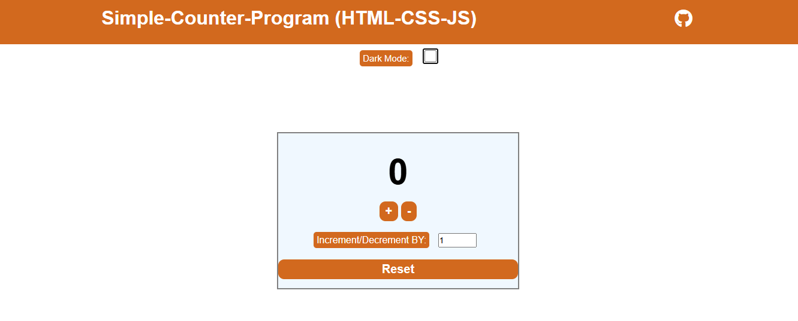

🔢 Counter App

A simple and interactive counter application built using **HTML, CSS, and JavaScript**.
This project allows users to increase, decrease, and reset a counter value in real-time.

Live Demo
👉 https://bilalmustofa.github.io/Simple-Counter-Program-HTML-CSS-JS-

Screenshot

Features
*  Increment counter
*  Decrement counter
*  Reset counter

Thanks for checking out this project!
Feel free to give feedback or suggestions.

